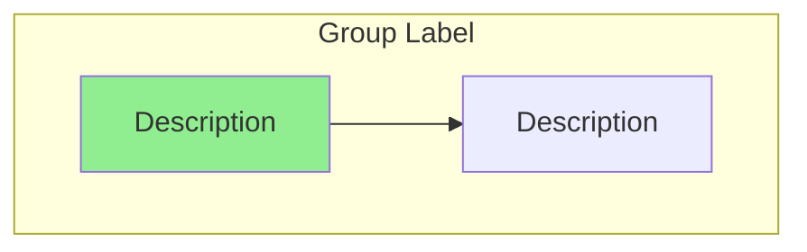
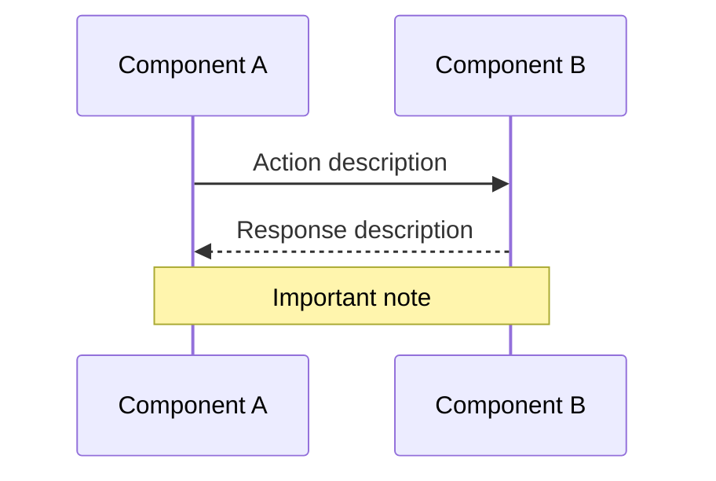

# Flow Diagram Generator

Generate Mermaid flowcharts and sequence diagrams that help you understand or document code flows in the Airbyte Python CDK.

This skill supports two modes:

1. **Understanding mode** (default) — The user wants to understand how something works. Diagram the existing code flow for the area they're asking about.
2. **Change mode** — The user is on a feature branch with changes. Diagram the flows impacted by those changes, highlighting what's new or modified.

## Your question

<question>
$ARGUMENTS
</question>

## Output Location

All flow diagrams are saved to `thoughts/diagrams/YYYY-MM-DD-{topic-slug}.md`.

Create the directory if needed:
```bash
mkdir -p thoughts/diagrams
```

## Instructions

### Step 1: Determine the Mode

Check if the user provided a specific topic/question in `$ARGUMENTS`, or if they want branch-level change diagrams.

**Understanding mode** — Use when:
- The user asks about a specific component, flow, or concept (e.g., "pagination", "OAuth flow", "how does incremental sync work")
- The user names a specific file, class, or module
- The user asks "how does X work?"

**Change mode** — Use when:
- The user says "diagram my changes" or similar
- The user wants PR documentation
- No specific topic is given and they're on a feature branch

For **change mode**, validate the branch:
```bash
git branch --show-current
```
If on `main`, ask what they'd like to understand instead.

### Step 2: Research the Code

#### Understanding Mode

1. **Identify the target area** from the user's question. Map it to CDK modules:

   | Topic Area | Key Modules |
   |------------|-------------|
   | **Declarative runtime** | `sources/declarative/concurrent_declarative_source.py`, `yaml_declarative_source.py`, `parsers/` |
   | **Component factory** | `sources/declarative/parsers/model_to_component_factory.py` |
   | **HTTP requests** | `sources/declarative/requesters/http_requester.py`, `sources/streams/http/` |
   | **Pagination** | `sources/declarative/requesters/paginators/`, `strategies/` |
   | **Authentication** | `sources/declarative/auth/`, `sources/streams/http/auth/` |
   | **Record extraction** | `sources/declarative/extractors/`, `record_selector.py` |
   | **Stream slicing** | `sources/declarative/partition_routers/`, `incremental/` |
   | **Incremental sync** | `sources/declarative/incremental/`, `sources/declarative/datetime/` |
   | **Transformations** | `sources/declarative/transformations/` |
   | **Error handling** | `sources/streams/http/error_handlers/`, `sources/declarative/requesters/error_handlers/` |
   | **Concurrency** | `sources/declarative/concurrent_declarative_source.py`, `sources/concurrent_source/` |
   | **Entrypoint / CLI** | `entrypoint.py`, `connector.py`, `cli/` |
   | **Schema / models** | `sources/declarative/models/`, `declarative_component_schema.yaml` |
   | **Connector builder** | `connector_builder/` |
   | **Manifest migrations** | `manifest_migrations/` |
   | **Legacy Python CDK** | `sources/streams/core.py`, `sources/streams/http/http.py`, `sources/abstract_source.py` |

2. **Use sub-agents to trace the flow:**
   ```
   Task(subagent_type="cdk-code-researcher", prompt="Trace the data flow for [component/concept] in the Airbyte Python CDK.
   Identify: entry points, class hierarchies, method call chains, data transformations, and exit points.
   Focus on the runtime behavior — how data actually flows through the code.
   Document with file:line references.")
   ```

3. **Read the relevant source files** to understand:
   - Entry points (where does execution start?)
   - Class hierarchies (what extends what?)
   - Method call chains (what calls what in sequence?)
   - Data transformations (how is data shaped along the way?)
   - Branching logic (where do different code paths diverge?)
   - Integration points (where does this connect to other CDK subsystems?)

#### Change Mode

1. **Get the commit history:**
   ```bash
   git log main..HEAD --oneline
   ```

2. **Get the full diff:**
   ```bash
   git diff main...HEAD
   ```

3. **List changed files:**
   ```bash
   git diff main...HEAD --name-only
   ```

4. **Use sub-agents to understand impacted flows:**
   ```
   Task(subagent_type="cdk-code-researcher", prompt="Trace the data flow for [changed component].
   Identify: entry points, data transformations, method call chains, and exit points.
   Document with file:line references.")
   ```

### Step 3: Generate Diagrams

Based on your analysis, determine which diagram types best represent what the user is trying to understand:

#### Flowchart (When to Include)
Include a flowchart when explaining:
- Multi-step processes or workflows (e.g., "how does a read operation work?")
- Conditional logic with branching paths (e.g., "how does error handling decide to retry?")
- Data flowing through multiple components (e.g., "how does a record go from HTTP response to output?")
- State machines or status transitions (e.g., "cursor state management")
- Class/component composition (e.g., "what components make up a declarative stream?")

#### Sequence Diagram (When to Include)
Include a sequence diagram when explaining:
- Multiple objects/classes interacting over time (e.g., "how do retriever, requester, and paginator coordinate?")
- Request/response patterns (e.g., "OAuth token refresh flow")
- Temporal ordering of operations (e.g., "what happens during a sync from start to finish?")
- Method call chains across classes (e.g., "how does `read_records` delegate work?")

### Step 4: Output Format

Generate the documentation using this template:

````markdown
## Diagrams
### Flowchart

[Include if applicable - see criteria above]



### Sequence Diagram

[Include if applicable - see criteria above]


````

## Diagram Guidelines

### Flowchart Best Practices
- Use `subgraph` to group related components (e.g., "Declarative Framework", "HTTP Layer", "Record Processing")
- Use descriptive node labels that reference actual class/method names
- In **change mode**, highlight NEW or CHANGED nodes with `style nodeName fill:#90EE90` (green)
- In **understanding mode**, use colors to distinguish component types:
  - `#90EE90` (light green) - Entry points / triggers
  - `#FFE4B5` (moccasin) - Data sources / inputs
  - `#87CEEB` (sky blue) - Outputs / results
  - `#DDA0DD` (plum) - Decision points / branching logic
- Add edge labels to explain data transformations: `-->|"description"|`
- Reference actual class names in nodes (e.g., `SimpleRetriever.read_records()`)

### Sequence Diagram Best Practices
- Use actual class names as participants: `participant R as SimpleRetriever`
- Group related interactions with `Note over` blocks
- Use `loop` for pagination or retry loops
- Use `alt`/`else` for conditional flows (error handling, auth refresh)
- Keep message descriptions as actual method names when possible

### When NOT to Generate Diagrams

Skip diagram generation if:
- The topic is trivially simple (single function, no branching)
- The user is asking a factual question that doesn't involve a flow ("what version of pydantic does the CDK use?")
- The concept is better explained with a code snippet than a diagram

In these cases, inform the user and offer a brief text explanation instead.

## Output

### Step 5: Save the Document

Write the diagram documentation to `thoughts/diagrams/YYYY-MM-DD-{topic-slug}.md`:

```markdown
# {Title}

**Date**: [Current date]
**Topic**: {What this diagram explains}

## Overview
A brief 2-3 sentence summary of what these diagrams show and why it matters.

## Key Files
Bulleted list of the most relevant source files:
- `airbyte_cdk/path/to/file.py` — Description

## Diagrams

[Include the generated diagrams here]

## Explanation
Walk through the diagram(s) step by step, referencing specific nodes/participants.
Include relevant code snippets from the CDK to support the explanation.
```

After saving, inform the user:
```
Flow diagrams saved to: thoughts/diagrams/YYYY-MM-DD-{topic-slug}.md
```

### Handling Non-Diagram Cases

If only one diagram type is applicable, only include that one. If neither is applicable, explain why and offer a text-based explanation instead — do not create a file in this case.

## Rules

- ALWAYS read the actual CDK source code before generating diagrams — do not guess how components work
- Reference actual class names, method names, and file paths in diagrams
- Keep diagrams focused — a diagram that tries to show everything shows nothing
- For complex flows, prefer multiple focused diagrams over one massive diagram
- When a flow spans both declarative and legacy CDK, note which parts belong to which
- Do NOT diagram test code unless specifically asked
